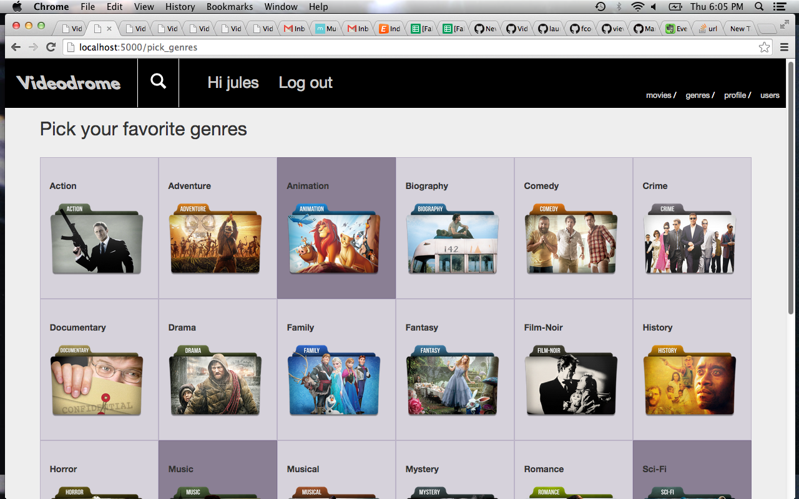
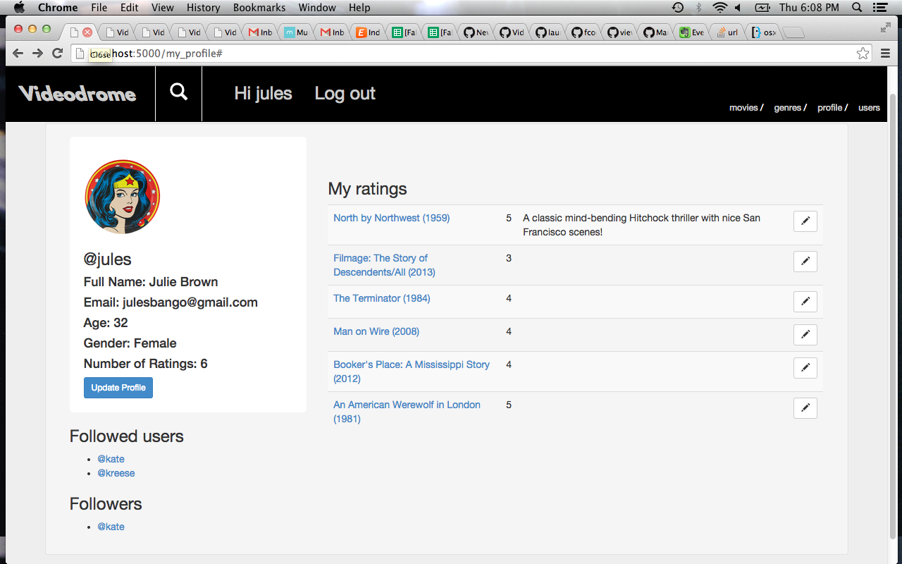
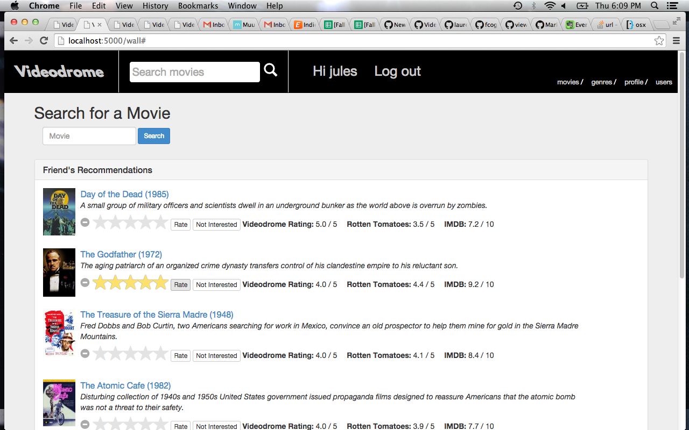
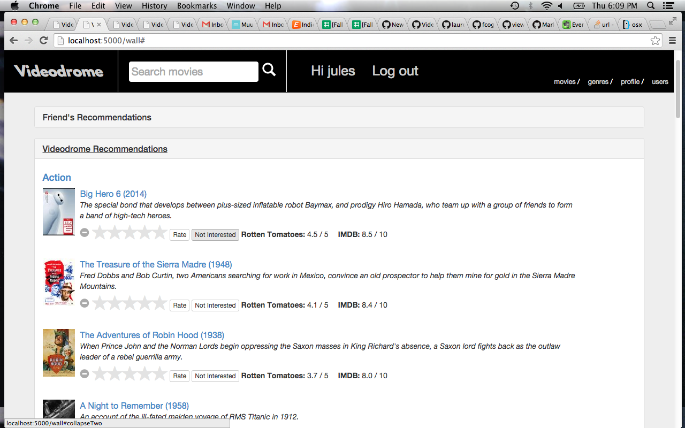
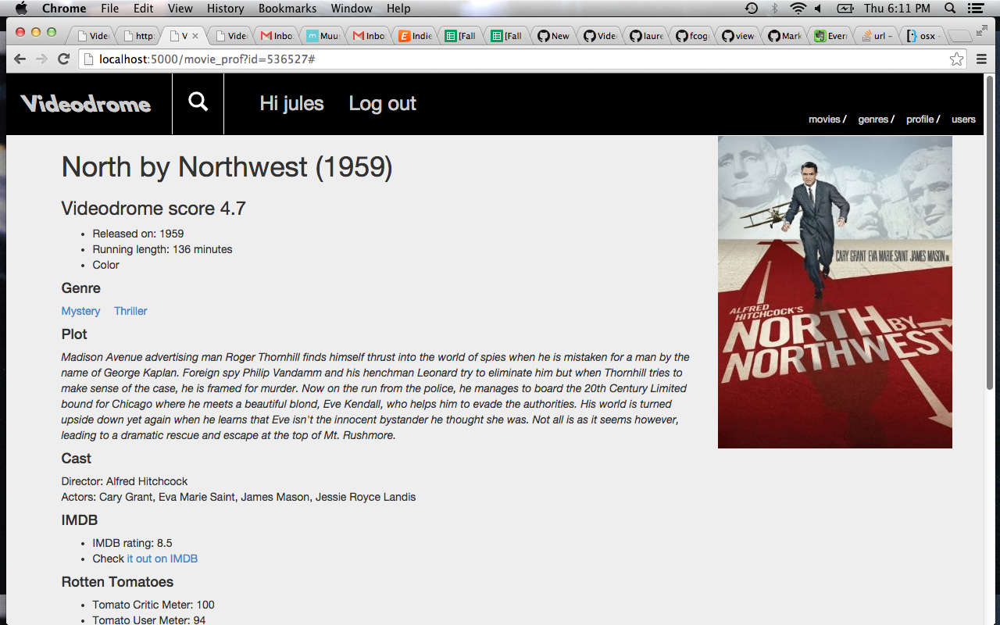
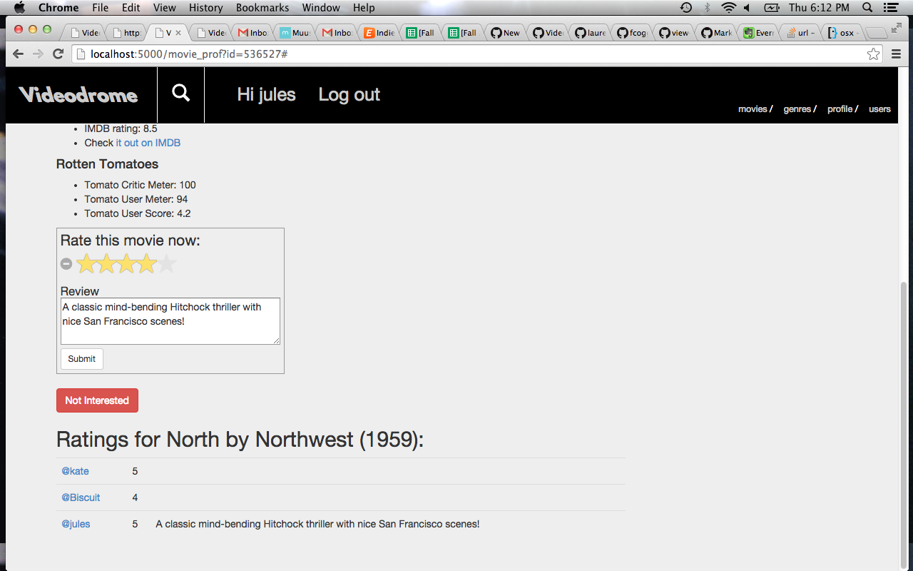

Videodrome
==========

###Summary
Choosing what to watch is an age-old problem. When looking for new movies, I often consider three things: ratings on major websites, genre, and friends' opinions. Videodrome simplifies the search process, bringing these pieces together. Having imported the freely available IMDB dataset, Videodrome gives users access to the most comprehensive collection of entertainment available, with movie details, ratings from multiple sources, and user interaction, providing optimal recommendations results.
Videodrone is ready to help you find your next favorite movie!

###Users can
* As logged out user, perform movie searches with view of details and website ratings
* Log-in/logout and sign-up for a new account
* As logged in user:
* Update user profile
* Pick/update favorite genres
* Follow users via a one-way join, and view their profile and ratings
* Query two recommendations engines based on: 
  1. friend's ratings
  2. picked genres and major website (IMDB & Rotten Tomatoes) ratings
* Perform movie search with addtional view into user ratings
* Rate and review movies
* Choose not interested option, removing movie from recommendations lists

###Screenshots

####Front Page/Navbar login/Sign up link

####Users pick genres and can update at any time

####User profile which can be updated, ratings/reviews with edit link, followees and followers are connected via one way joins

####Recommedations Engines, comprosed of 2 collapsable lists

1. ######Friends recommendations engine, querying all followee rated movies, sorted in descending order by site average score, filtering out movies already rated by user or not interested (which adds 0 score to ratings table)

2. ######Videodrome recommendations engine, querying movies in picked genres, sorted in descending order by IMDB and Rotten Tomatoes critics scores, with above filters

####Movie profile page 
With extended movie details

And place to add rating and review, along with other user ratings

###Technology Stack
* Python 2.7
* MySQL 5.6.21
* IMDdPY 5.0
* OMDb API
* Flask 0.9
* SQLAlchemy 0.7.9
* Jinja2 2.6
* HTML5 / CSS
* Bootstrap 3.3.0
* jQuery

###Acknowledgements
* Front page background image from <a href="http://www.geekoutpost.com/">Geek Outpost<a/>
* Genres folder images from <a href="http://icons.iconarchive.com/">Icons Archive<a/>
* Logo font from http://www.1001freefonts.com/ by Robert Jablonski
* Star ratings from Kartik Visweswaran, <a href="Krajee.com">Krajee.com</a>, 2014 @version 3.3.0

