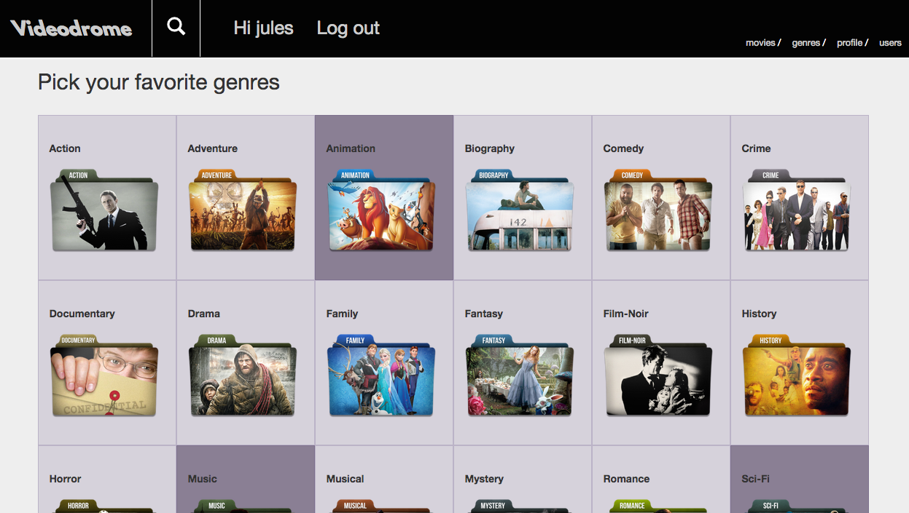
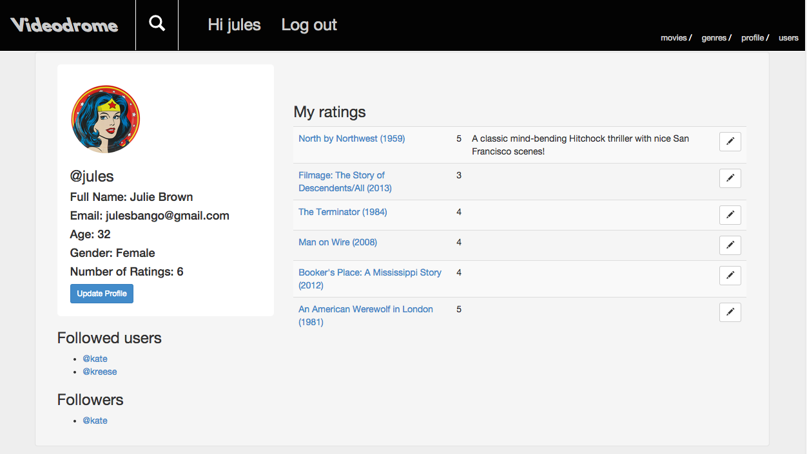
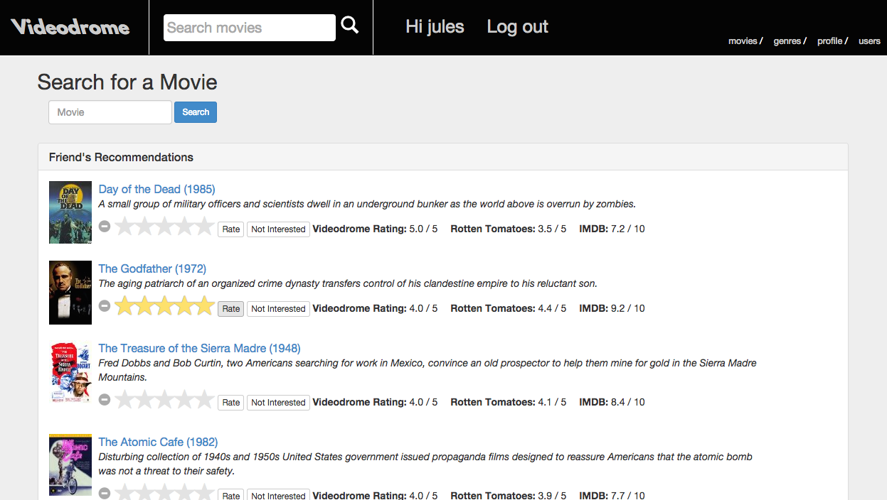
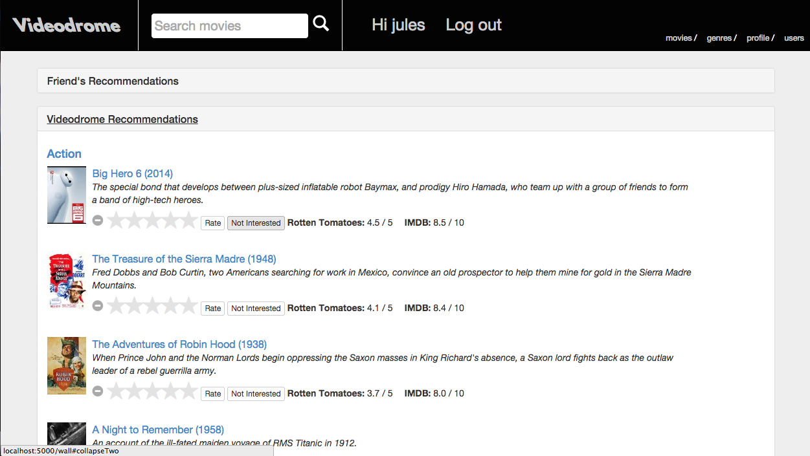
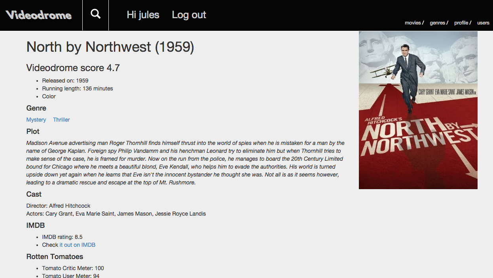
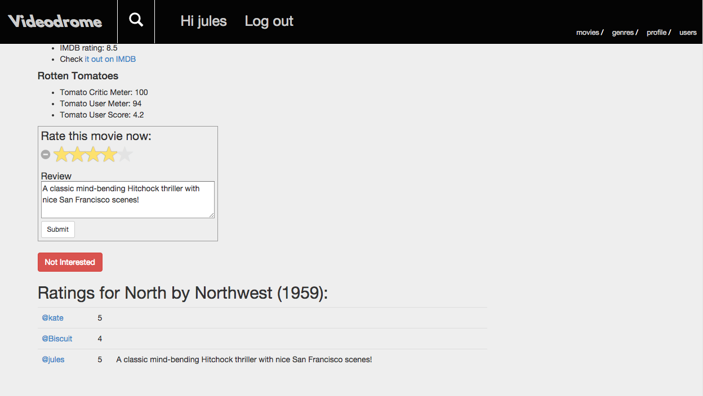

Videodrome
==========

###Summary
Choosing what to watch is an age-old problem. When looking for new movies, three common considerations are: ratings on major websites, genre, and friends' opinions. Videodrome simplifies the search process, bringing these pieces together. Having imported the IMDB dataset, sanitized and aggregated with other site ratings, Videodrome gives users access to the most comprehensive collection of movies available, adding in user interaction to provide relevant recommendations results.

###Key techniques used
* Aggregated data sources using two importing tools to create extensive database:
    1. <a href="http://imdbpy.sourceforge.net/">IMDbPY</a>
    2. <a href="http://www.omdbapi.com/">OMDb API</a>
* Reorganized data for better querying and results:
    1. Designed an ETL process
    2. Sanitized Used spot queries to remove unwanted content
* Recommendations loadtime optimization using:
    * Indexing
    * Caching
    * Reduced subqueries with joins
    
###Features
* Log in/log out and sign up for a new account
* As logged out user:
    * perform movie searches with view of details and website ratings
* As logged in user:
    * Update user profile
    * Pick/update favorite genres
    * Follow users via a one-way join, and view their profile and ratings
    * Query two recommendations engines based on: 
      1. friend's ratings
      2. picked genres and major website (IMDB & Rotten Tomatoes) ratings
    * Perform movie search with addtional view into user ratings
    * Rate and review movies
    * Choose not interested option, removing movie from recommendations lists

###Technology Stack
* Python
* MySQL
* IMDdPY
* OMDb API
* Flask
* SQLAlchemy
* Jinja2
* HTML5 / CSS
* Bootstrap
* jQuery

###Screenshots

####Front Page / Navbar login / Sign up link

####Users pick genres; update any time

####User profile update / Ratings and reviews with editability / Users connected via one way joins

####Recommedations Engines, composed of 2 collapsable lists

1. ######Friends recommendations engine: querying all followee rated movies, sorted in descending order by site average score, filtering out movies already rated by user or not interested (which adds 0 score to ratings table)

2. ######Videodrome recommendations engine: querying movies in picked genres, sorted in descending order by IMDB and Rotten Tomatoes critics scores, with above filters

####Movie profile page 
With extended movie details

And place to add rating and review, along with other user ratings

###Design Acknowledgements
* Front page background image from <a href="http://www.geekoutpost.com/">Geek Outpost<a/>
* Genres folder images from <a href="http://icons.iconarchive.com/">Icons Archive<a/>
* Logo font from http://www.1001freefonts.com/ by Robert Jablonski
* Star ratings from Kartik Visweswaran, <a href="Krajee.com">Krajee.com</a>, 2014 @version 3.3.0

